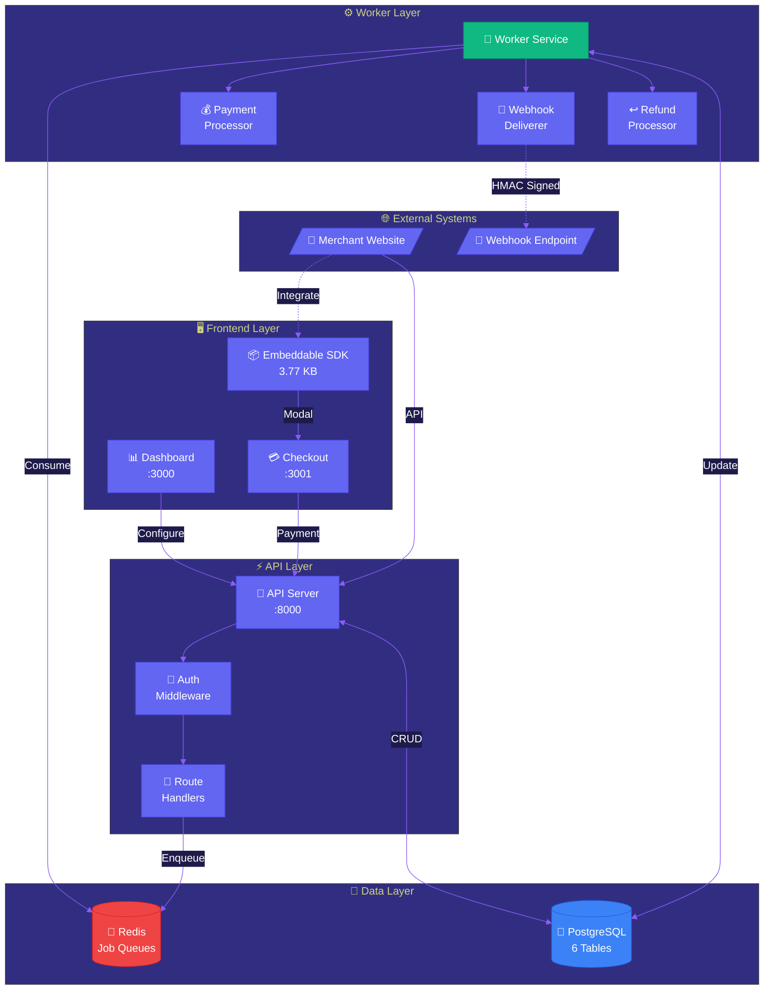
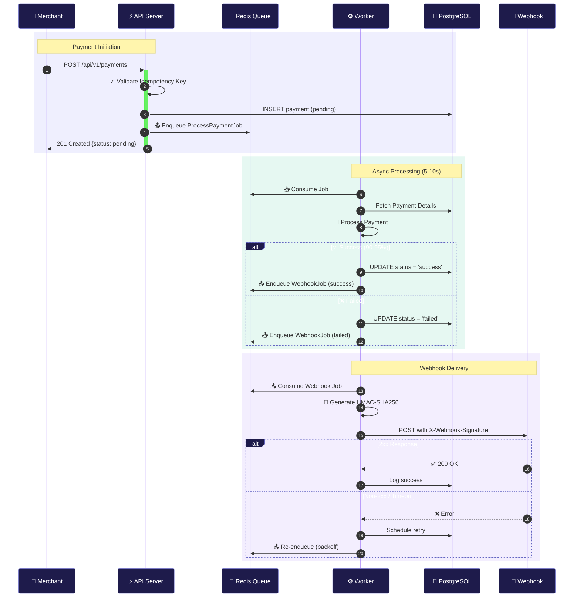
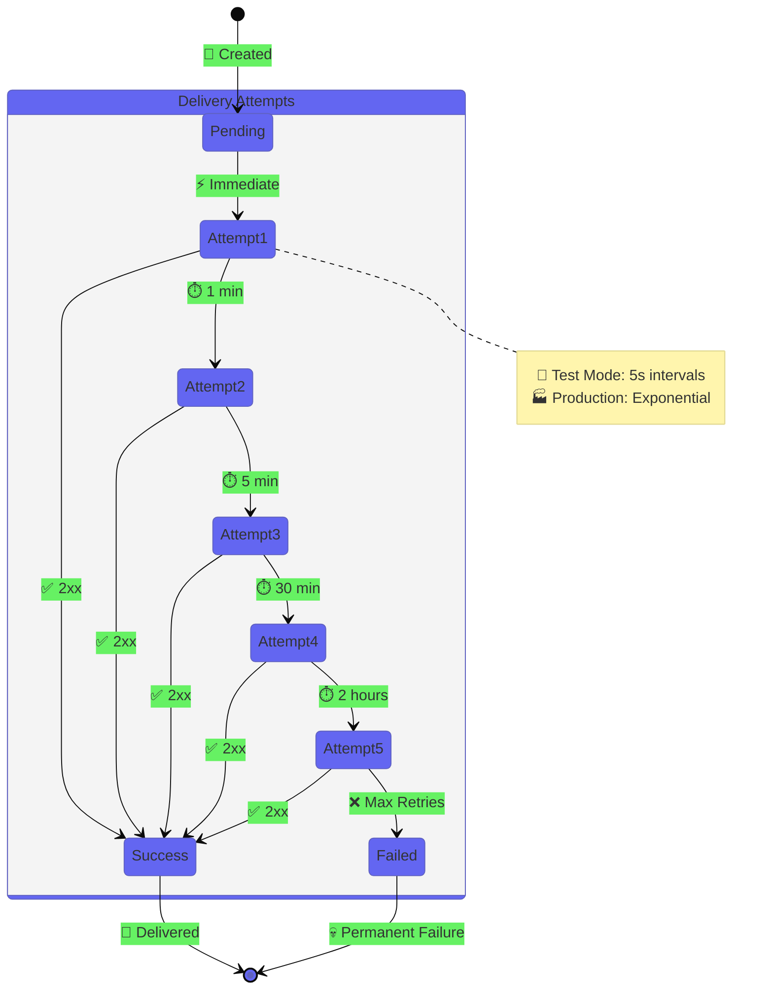
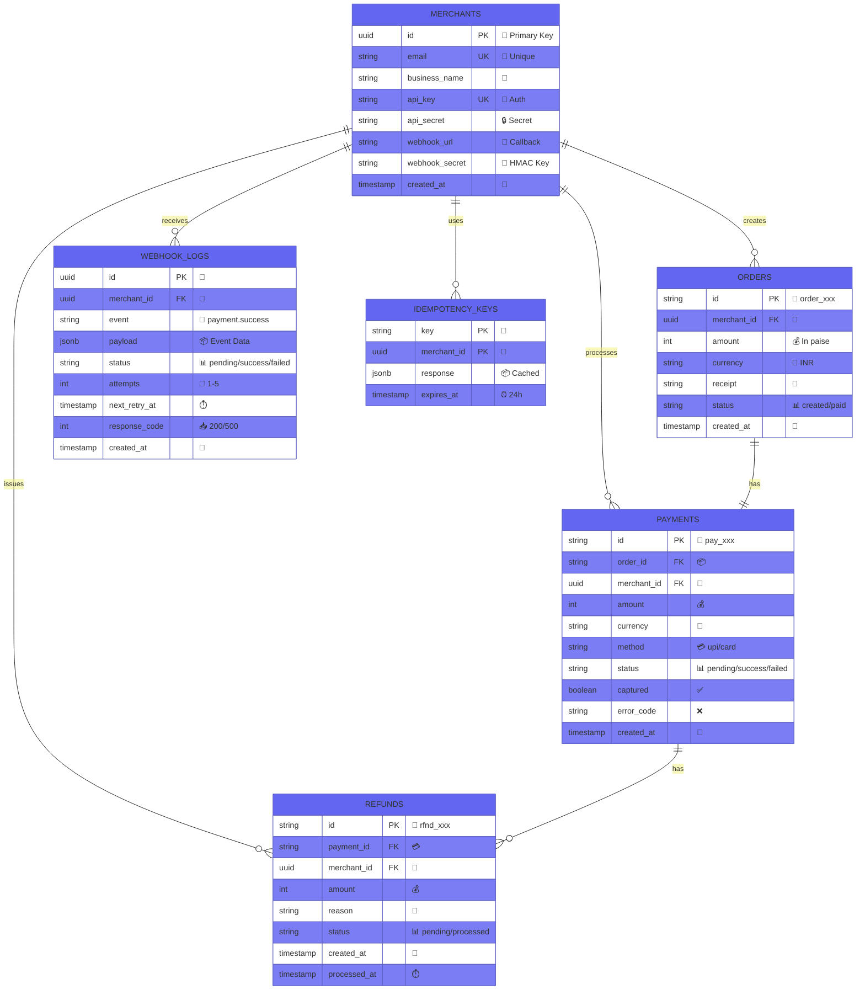
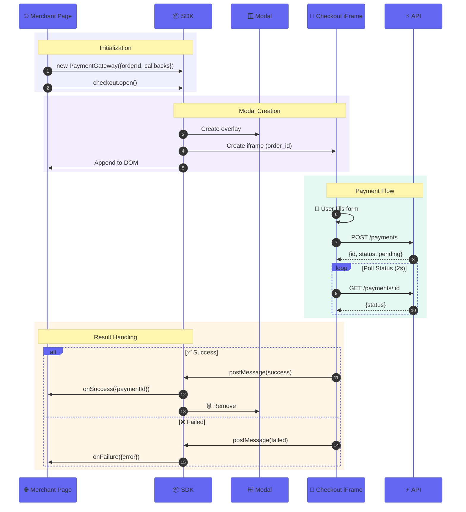
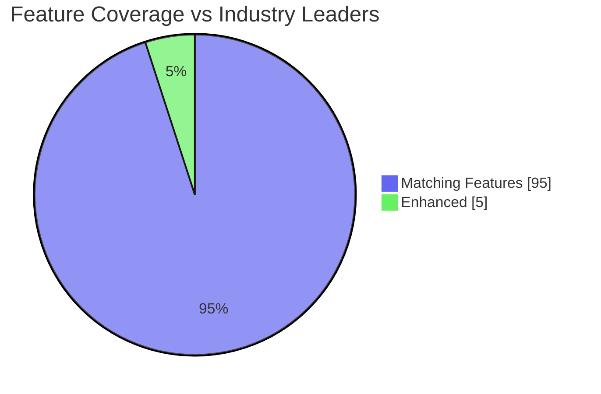
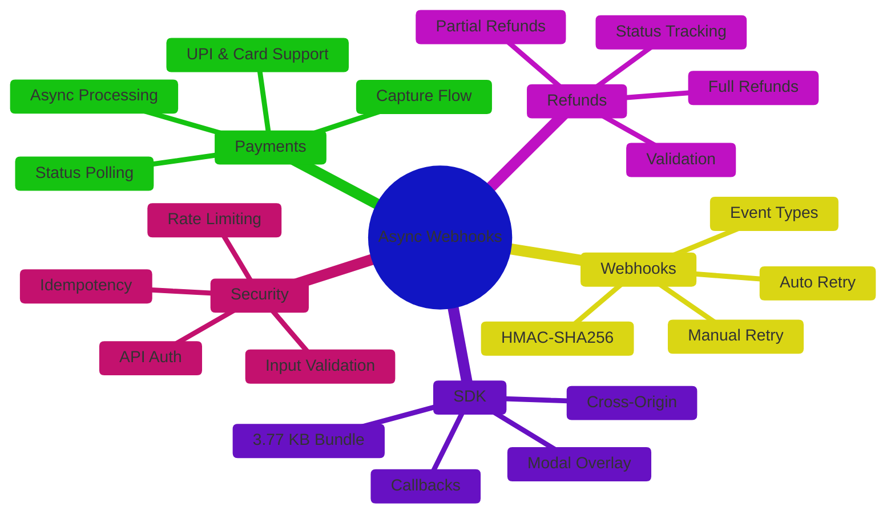

# 🚀 Payment Gateway Async Webhooks

<div align="center">


> **Enterprise-Grade Async Payment Processing with Webhooks**  
> Built with modern architecture patterns used by Stripe, Razorpay & PayPal

[](https://nodejs.org/)
[](https://expressjs.com/)
[](https://www.postgresql.org/)
[](https://redis.io/)
[](https://docs.docker.com/compose/)
[](https://reactjs.org/)

</div>

---

## 📋 Table of Contents

<details>
<summary>Click to expand</summary>

- [System Architecture](#-system-architecture)
- [Industrial-Level Standards](#-industrial-level-standards)
- [Features](#-features)
- [Quick Start](#-quick-start)
- [Project Structure](#-project-structure)
- [API Documentation](#-api-documentation)
- [SDK Integration](#-sdk-integration)
- [Webhook Integration](#-webhook-integration)
- [Testing](#-testing)
- [Environment Variables](#-environment-variables)
- [Troubleshooting](#-troubleshooting)

</details>

---

## 🏗️ System Architecture

### High-Level Overview



### 🔄 Async Payment Processing Flow



### ⏱️ Webhook Retry State Machine



### 🗄️ Database Entity Relationship



### 🔌 SDK Integration Flow



---

## 🏭 Industrial-Level Standards

### Why This Project Meets Industrial Standards

<table>
<tr>
<td width="50%">

#### 1. 🏛️ Scalable Microservices Architecture
- ✅ **Separation of Concerns**: API, Worker, Frontend independent
- ✅ **Horizontal Scaling**: Each service scales independently
- ✅ **Service Isolation**: Failures don't cascade
- ✅ **Docker Orchestration**: Production-ready containers

*Similar to: Stripe, Razorpay architecture*

</td>
<td width="50%">

#### 2. ⚡ Async Processing with Job Queues
- ✅ **Non-Blocking API**: Returns immediately
- ✅ **Background Processing**: Bull + Redis
- ✅ **Job Persistence**: Survives restarts
- ✅ **Retry Mechanisms**: Automatic recovery

*Similar to: PayPal, Square systems*

</td>
</tr>
<tr>
<td width="50%">

#### 3. 🔔 Robust Webhook System
- ✅ **HMAC-SHA256 Signatures**: Industry standard
- ✅ **Exponential Backoff**: 1m → 5m → 30m → 2h
- ✅ **Delivery Guarantees**: Persistent scheduling
- ✅ **Manual Retry**: Dashboard support

*Identical to: Stripe webhook system*

</td>
<td width="50%">

#### 4. 🔐 Idempotency for Safety
- ✅ **Duplicate Prevention**: Cached responses
- ✅ **24-Hour Expiry**: Storage efficient
- ✅ **Merchant Scoping**: Isolated keys

*Standard in: Stripe, Square, Adyen APIs*

</td>
</tr>
<tr>
<td width="50%">

#### 5. 🗄️ Production-Ready Database
- ✅ **Proper Indexing**: Optimized queries
- ✅ **Data Integrity**: Foreign key constraints
- ✅ **Audit Trail**: Complete timestamps
- ✅ **JSONB Flexibility**: Dynamic payloads

</td>
<td width="50%">

#### 6. 🛡️ Security Best Practices
- ✅ **API Authentication**: Key + Secret
- ✅ **HMAC Signatures**: Cryptographic verification
- ✅ **SQL Injection Prevention**: Parameterized queries
- ✅ **Input Validation**: All inputs checked

</td>
</tr>
</table>

### 📊 Industry Comparison Matrix



| Feature | This Project | Stripe | Razorpay | PayPal |
|:--------|:------------:|:------:|:--------:|:------:|
| Async Processing | ✅ Bull+Redis | ✅ | ✅ | ✅ |
| Webhook Signatures | ✅ HMAC-256 | ✅ | ✅ | ✅ |
| Exponential Backoff | ✅ 1m-2h | ✅ | ✅ | ✅ |
| Idempotency Keys | ✅ 24h | ✅ | ✅ | ✅ |
| Embeddable SDK | ✅ 3.77KB | ✅ | ✅ | ✅ |
| Refund Management | ✅ Full/Partial | ✅ | ✅ | ✅ |
| Docker Deployment | ✅ | ✅ | ✅ | ✅ |
| Test Mode | ✅ | ✅ | ✅ | ✅ |

---

## ✨ Features

### 🎯 Core Functionality



---

## 🚀 Quick Start

### Prerequisites
- Docker Desktop running
- Node.js 18+ (for local development)
- Git

### Installation

```bash
# Clone repository
git clone https://github.com/chdsssbaba/payment-gateway-async-webhooks.git
cd payment-gateway-async-webhooks

# Start all services
docker-compose up -d

# Wait 30-60 seconds for services to be ready
# Check service health
docker-compose ps
```

### Access Points

| Service | URL | Description |
|---------|-----|-------------|
| **API** | http://localhost:8000 | REST API server |
| **Dashboard** | http://localhost:3000 | Merchant dashboard |
| **Webhooks** | http://localhost:3000/webhooks | Webhook configuration |
| **API Docs** | http://localhost:3000/docs | Integration guide |
| **Checkout** | http://localhost:3001 | Payment checkout page |

### Test Credentials

```
API Key: key_test_abc123
API Secret: secret_test_xyz789
Webhook Secret: whsec_test_abc123
```

---

## 🎬 Demonstration

### Option 1: Merchant Dashboard (No Coding Required)

For merchants who want to create orders without writing code:

1. **Open Merchant Dashboard:**
   ```
   Open: merchant-dashboard.html (in project root)
   ```

2. **Create an Order:**
   - Enter amount (e.g., 500 for ₹500)
   - Enter customer name (optional)
   - Click "Create Order & Get Checkout Link"

3. **Share Checkout Link:**
   - Copy the generated checkout URL
   - Share with your customer

4. **Customer Completes Payment:**
   - Customer opens the checkout link
   - Enters UPI ID: `success@paytm` (for testing)
   - Clicks "Pay Now"
   - Sees "Payment successful!"

5. **View Webhook Logs:**
   - Go to http://localhost:3000/webhooks
   - See `payment.success` event logged

### Option 2: API Integration (For Developers)

Complete flow using API calls:

```bash
# Step 1: Create Order
curl -X POST http://localhost:8000/api/v1/orders \
  -H "X-Api-Key: key_test_abc123" \
  -H "X-Api-Secret: secret_test_xyz789" \
  -H "Content-Type: application/json" \
  -d '{"amount": 50000, "currency": "INR", "receipt": "demo_001"}'

# Response: {"id": "order_xyz123", ...}

# Step 2: Create Payment
curl -X POST http://localhost:8000/api/v1/payments \
  -H "X-Api-Key: key_test_abc123" \
  -H "X-Api-Secret: secret_test_xyz789" \
  -H "Idempotency-Key: unique_$(date +%s)" \
  -H "Content-Type: application/json" \
  -d '{
    "order_id": "order_xyz123",
    "method": "upi",
    "vpa": "success@paytm"
  }'

# Response: {"id": "pay_abc456", "status": "pending", ...}

# Step 3: Wait for async processing (5 seconds)
sleep 5

# Step 4: Check payment status
curl http://localhost:8000/api/v1/payments/pay_abc456 \
  -H "X-Api-Key: key_test_abc123" \
  -H "X-Api-Secret: secret_test_xyz789"

# Response: {"id": "pay_abc456", "status": "success", ...}

# Step 5: View webhook logs
curl http://localhost:8000/api/v1/webhooks?limit=5 \
  -H "X-Api-Key: key_test_abc123" \
  -H "X-Api-Secret: secret_test_xyz789"
```

### Option 3: SDK Integration (Embedded Widget)

For merchants who want to embed payments on their website:

```html
<!DOCTYPE html>
<html>
<head>
    <title>My Store</title>
    <script src="http://localhost:3001/checkout.js"></script>
</head>
<body>
    <button id="payButton">Pay ₹500</button>
    
    <script>
        document.getElementById('payButton').onclick = async function() {
            // 1. Create order from your backend
            const response = await fetch('http://localhost:8000/api/v1/orders', {
                method: 'POST',
                headers: {
                    'X-Api-Key': 'key_test_abc123',
                    'X-Api-Secret': 'secret_test_xyz789',
                    'Content-Type': 'application/json'
                },
                body: JSON.stringify({
                    amount: 50000,
                    currency: 'INR',
                    receipt: 'order_001'
                })
            });
            const order = await response.json();
            
            // 2. Open payment gateway modal
            const checkout = new PaymentGateway({
                key: 'key_test_abc123',
                orderId: order.id,
                onSuccess: (data) => {
                    alert('Payment successful! ID: ' + data.paymentId);
                },
                onFailure: (error) => {
                    alert('Payment failed: ' + error.error);
                }
            });
            
            checkout.open();
        };
    </script>
</body>
</html>
```

### Visual Flow

```
Merchant Dashboard → Create Order → Get Checkout Link
                                          ↓
Customer → Open Link → Enter UPI → Pay Now → Success!
                                          ↓
Worker → Process Payment (2s) → Update Status → Create Webhook
                                          ↓
Merchant → Receives Webhook → Marks Order Complete
```

---

## 📁 Project Structure

```
payment-gateway-async-pro/
│
├── 📁 backend/                          # API Server & Worker
│   ├── src/
│   │   ├── routes/                      # API Endpoints
│   │   │   ├── orders.js                # POST /api/v1/orders
│   │   │   ├── payments.js              # POST /api/v1/payments, capture, refunds
│   │   │   ├── refunds.js               # GET /api/v1/refunds/:id
│   │   │   ├── webhooks.js              # GET /api/v1/webhooks, retry
│   │   │   └── test.js                  # GET /api/v1/test/jobs/status
│   │   │
│   │   ├── jobs/                        # Background Job Processors
│   │   │   ├── ProcessPaymentJob.js     # 5-10s payment processing
│   │   │   ├── DeliverWebhookJob.js     # HMAC + exponential backoff
│   │   │   └── ProcessRefundJob.js      # 3-5s refund processing
│   │   │
│   │   ├── services/                    # Business Logic
│   │   │   ├── WebhookService.js        # HMAC signature generation
│   │   │   └── IdempotencyService.js    # Duplicate prevention
│   │   │
│   │   ├── middleware/                  # Request Middleware
│   │   │   └── auth.js                  # API key authentication
│   │   │
│   │   ├── config/                      # Configuration
│   │   │   ├── database.js              # PostgreSQL connection pool
│   │   │   └── queue.js                 # Bull queue setup
│   │   │
│   │   ├── workers/                     # Worker Service
│   │   │   └── index.js                 # Job queue consumer
│   │   │
│   │   └── index.js                     # API server entry point
│   │
│   ├── migrations/                      # Database Schema
│   │   ├── 001_initial_schema.sql       # Base tables (merchants, orders, payments)
│   │   └── 002_async_features.sql       # Async tables (refunds, webhooks, idempotency)
│   │
│   ├── Dockerfile                       # API container image
│   ├── Dockerfile.worker                # Worker container image
│   └── package.json                     # Node.js dependencies
│
├── 📁 dashboard/                         # Merchant Dashboard (React)
│   ├── src/
│   │   ├── pages/
│   │   │   ├── Home.js                  # Dashboard home with credentials
│   │   │   ├── Webhooks.js              # Webhook config & logs
│   │   │   └── ApiDocs.js               # Integration documentation
│   │   ├── App.js                       # React router
│   │   └── index.js                     # Entry point
│   │
│   ├── Dockerfile                       # Dashboard container (multi-stage)
│   └── nginx.conf                       # Nginx configuration
│
├── 📁 checkout/                          # Payment Checkout (React)
│   ├── src/
│   │   ├── App.js                       # Payment form with postMessage
│   │   └── index.css                    # Checkout styles
│   │
│   ├── Dockerfile                       # Checkout container
│   └── nginx.conf                       # Nginx configuration
│
├── 📁 checkout-widget/                   # Embeddable SDK
│   ├── src/sdk/
│   │   └── PaymentGateway.js            # SDK class (modal + iframe)
│   │
│   ├── dist/
│   │   └── checkout.js                  # Built SDK (3.77 KB)
│   │
│   ├── webpack.config.js                # Webpack UMD bundler
│   └── package.json                     # SDK dependencies
│
├── 📁 test-merchant/                     # Test Webhook Receiver
│   ├── webhook-receiver.js              # Express server (port 4000)
│   └── package.json                     # Dependencies
│
├── 📁 docs/                              # Documentation
│   └── ARCHITECTURE.md                  # Detailed system design
│
├── 📄 docker-compose.yml                 # 6-Service Orchestration
├── 📄 submission.yml                     # Evaluation Configuration
├── 📄 README.md                          # This file (comprehensive docs)
├── 📄 merchant-dashboard.html            # No-code order creation UI
├── 📄 .env.example                       # Environment variables template
└── 📄 .gitignore                         # Git ignore rules

**Total:** 50+ files | 3,000+ lines of code | 6 microservices
```

### Technology Stack

| Layer | Technology | Purpose |
|-------|-----------|---------|
| **API Server** | Node.js + Express | REST API endpoints |
| **Worker** | Node.js + Bull | Async job processing |
| **Database** | PostgreSQL 15 | Data persistence |
| **Queue** | Redis 7 | Job queue storage |
| **Dashboard** | React 18 | Merchant portal |
| **Checkout** | React 18 | Payment form |
| **SDK** | Vanilla JS + Webpack | Embeddable widget |
| **Container** | Docker Compose | Service orchestration |

---

## 📚 API Documentation

### Authentication

All API requests require authentication headers:

```bash
X-Api-Key: key_test_abc123
X-Api-Secret: secret_test_xyz789
```

### Endpoints

#### 1. Create Order

```bash
curl -X POST http://localhost:8000/api/v1/orders \
  -H "X-Api-Key: key_test_abc123" \
  -H "X-Api-Secret: secret_test_xyz789" \
  -H "Content-Type: application/json" \
  -d '{
    "amount": 50000,
    "currency": "INR",
    "receipt": "receipt_123"
  }'
```

**Response:**
```json
{
  "id": "order_NXhj67fGH2jk9mPq",
  "amount": 50000,
  "currency": "INR",
  "receipt": "receipt_123",
  "status": "created",
  "created_at": "2024-01-15T10:30:00Z"
}
```

#### 2. Create Payment (Async)

```bash
curl -X POST http://localhost:8000/api/v1/payments \
  -H "X-Api-Key: key_test_abc123" \
  -H "X-Api-Secret: secret_test_xyz789" \
  -H "Idempotency-Key: unique_request_id_123" \
  -H "Content-Type: application/json" \
  -d '{
    "order_id": "order_NXhj67fGH2jk9mPq",
    "method": "upi",
    "vpa": "user@paytm"
  }'
```

**Response:**
```json
{
  "id": "pay_H8sK3jD9s2L1pQr",
  "order_id": "order_NXhj67fGH2jk9mPq",
  "amount": 50000,
  "currency": "INR",
  "method": "upi",
  "vpa": "user@paytm",
  "status": "pending",
  "created_at": "2024-01-15T10:31:00Z"
}
```

**Note:** Payment is processed asynchronously. Status will be `pending` initially, then updated to `success` or `failed` by the worker (5-10 seconds).

#### 3. Get Payment Status

```bash
curl http://localhost:8000/api/v1/payments/pay_H8sK3jD9s2L1pQr \
  -H "X-Api-Key: key_test_abc123" \
  -H "X-Api-Secret: secret_test_xyz789"
```

#### 4. Create Refund

```bash
curl -X POST http://localhost:8000/api/v1/payments/pay_H8sK3jD9s2L1pQr/refunds \
  -H "X-Api-Key: key_test_abc123" \
  -H "X-Api-Secret: secret_test_xyz789" \
  -H "Content-Type: application/json" \
  -d '{
    "amount": 25000,
    "reason": "Customer requested partial refund"
  }'
```

#### 5. Get Webhook Logs

```bash
curl http://localhost:8000/api/v1/webhooks?limit=10&offset=0 \
  -H "X-Api-Key: key_test_abc123" \
  -H "X-Api-Secret: secret_test_xyz789"
```

#### 6. Job Queue Status (Test Endpoint - No Auth)

```bash
curl http://localhost:8000/api/v1/test/jobs/status
```

**Response:**
```json
{
  "pending": 5,
  "processing": 2,
  "completed": 100,
  "failed": 0,
  "worker_status": "running"
}
```

---

## 🔌 SDK Integration

### Installation

Add the SDK script to your website:

```html
<script src="http://localhost:3001/checkout.js"></script>
```

### Usage

```html
<button id="pay-button">Pay ₹500.00</button>

<script>
document.getElementById('pay-button').addEventListener('click', function() {
  const checkout = new PaymentGateway({
    key: 'key_test_abc123',
    orderId: 'order_xyz',
    onSuccess: function(response) {
      console.log('Payment successful:', response.paymentId);
      // Redirect to success page
      window.location.href = '/success?payment_id=' + response.paymentId;
    },
    onFailure: function(error) {
      console.log('Payment failed:', error);
      // Show error message
      alert('Payment failed: ' + error.error);
    },
    onClose: function() {
      console.log('Payment modal closed');
    }
  });
  
  checkout.open();
});
</script>
```

### SDK Features

- ✅ **Modal Overlay**: Responsive modal with iframe
- ✅ **Cross-Origin Communication**: PostMessage API
- ✅ **Callbacks**: onSuccess, onFailure, onClose
- ✅ **Small Size**: 3.77 KB minified
- ✅ **No Dependencies**: Vanilla JavaScript

---

## 🪝 Webhook Integration

### Configure Webhook URL

**Option 1: Via Dashboard**
1. Go to http://localhost:3000/webhooks
2. Enter your webhook URL
3. Copy the webhook secret
4. Click "Save Configuration"

**Option 2: Via Database**
```sql
UPDATE merchants 
SET webhook_url = 'https://yoursite.com/webhook',
    webhook_secret = 'whsec_test_abc123'
WHERE email = 'test@example.com';
```

### Verify Webhook Signature

```javascript
const crypto = require('crypto');
const express = require('express');
const app = express();

app.use(express.json());

app.post('/webhook', (req, res) => {
  const signature = req.headers['x-webhook-signature'];
  const payload = JSON.stringify(req.body);
  
  // Verify HMAC signature
  const expectedSignature = crypto
    .createHmac('sha256', 'whsec_test_abc123')
    .update(payload)
    .digest('hex');
  
  if (signature !== expectedSignature) {
    console.log('❌ Invalid signature');
    return res.status(401).send('Invalid signature');
  }
  
  console.log('✅ Webhook verified');
  console.log('Event:', req.body.event);
  console.log('Data:', req.body.data);
  
  // Process webhook
  // ...
  
  res.status(200).send('OK');
});

app.listen(4000);
```

### Webhook Events

| Event | Description | Payload |
|-------|-------------|---------|
| `payment.created` | Payment record created | Payment object |
| `payment.pending` | Payment in pending state | Payment object |
| `payment.success` | Payment succeeded | Payment object |
| `payment.failed` | Payment failed | Payment object with error |
| `refund.created` | Refund initiated | Refund object |
| `refund.processed` | Refund completed | Refund object |

### Retry Logic

Failed webhooks are automatically retried with exponential backoff:

| Attempt | Delay | Total Time |
|---------|-------|------------|
| 1 | Immediate | 0s |
| 2 | 1 minute | 1m |
| 3 | 5 minutes | 6m |
| 4 | 30 minutes | 36m |
| 5 | 2 hours | 2h 36m |

After 5 failed attempts, webhooks are marked as permanently failed. You can manually retry from the Dashboard.

---

## 🧪 Testing

### Test Webhook Receiver

```bash
cd test-merchant
npm install
node webhook-receiver.js
```

Then update merchant webhook URL to:
- **Windows/Mac:** `http://host.docker.internal:4000/webhook`
- **Linux:** `http://172.17.0.1:4000/webhook`

### Test Payment Flow

1. **Create an order:**
```bash
curl -X POST http://localhost:8000/api/v1/orders \
  -H "X-Api-Key: key_test_abc123" \
  -H "X-Api-Secret: secret_test_xyz789" \
  -H "Content-Type: application/json" \
  -d '{"amount": 50000, "currency": "INR", "receipt": "test_123"}'
```

2. **Open checkout page:**
```
http://localhost:3001/checkout?order_id=ORDER_ID
```

3. **Complete payment** (UPI or Card)

4. **Check webhook receiver logs** for delivery

### Test SDK

Open `test-sdk.html` in your browser:
```bash
# Windows
Start-Process test-sdk.html

# Mac/Linux
open test-sdk.html
```

### Test Mode Configuration

For faster testing, enable test mode in `docker-compose.yml`:

```yaml
environment:
  TEST_MODE: "true"
  TEST_PROCESSING_DELAY: "1000"  # 1 second instead of 5-10 seconds
  TEST_PAYMENT_SUCCESS: "true"   # Always succeed
  WEBHOOK_RETRY_INTERVALS_TEST: "true"  # 5-20 second retries
```

---

## 🔧 Environment Variables

| Variable | Default | Description |
|----------|---------|-------------|
| `DATABASE_URL` | - | PostgreSQL connection string |
| `REDIS_URL` | - | Redis connection string |
| `PORT` | 8000 | API server port |
| `NODE_ENV` | development | Environment (production/development) |
| `TEST_MODE` | false | Enable deterministic testing |
| `TEST_PROCESSING_DELAY` | 1000 | Payment processing delay (ms) |
| `TEST_PAYMENT_SUCCESS` | true | Force payment success in test mode |
| `WEBHOOK_RETRY_INTERVALS_TEST` | false | Use fast retry intervals (5-20s) |
| `JWT_SECRET` | - | JWT signing secret |
| `API_SECRET_SALT` | - | API secret hashing salt |

---

## 🐛 Troubleshooting

### Services not starting

```bash
# Check Docker logs
docker-compose logs -f

# Restart services
docker-compose restart

# Rebuild containers
docker-compose up -d --build
```

### Worker not processing jobs

```bash
# Check worker logs
docker-compose logs -f worker

# Verify Redis connection
docker-compose exec redis redis-cli ping

# Check job queue status
curl http://localhost:8000/api/v1/test/jobs/status
```

### Webhooks not delivering

1. Check merchant `webhook_url` is set in database
2. Verify webhook receiver is accessible
3. Check webhook logs in Dashboard: http://localhost:3000/webhooks
4. Manually retry failed webhooks from Dashboard

### Port conflicts

```bash
# Stop all services
docker-compose down

# Remove containers
docker rm -f gateway_api gateway_worker gateway_dashboard gateway_checkout postgres_gateway redis_gateway

# Check what's using the port
netstat -ano | findstr "8000"

# Restart
docker-compose up -d
```

---

## 📝 License

MIT


**Payment Gateway Async Webhooks** | **Production-Ready** | **Scalable** | **Secure**
